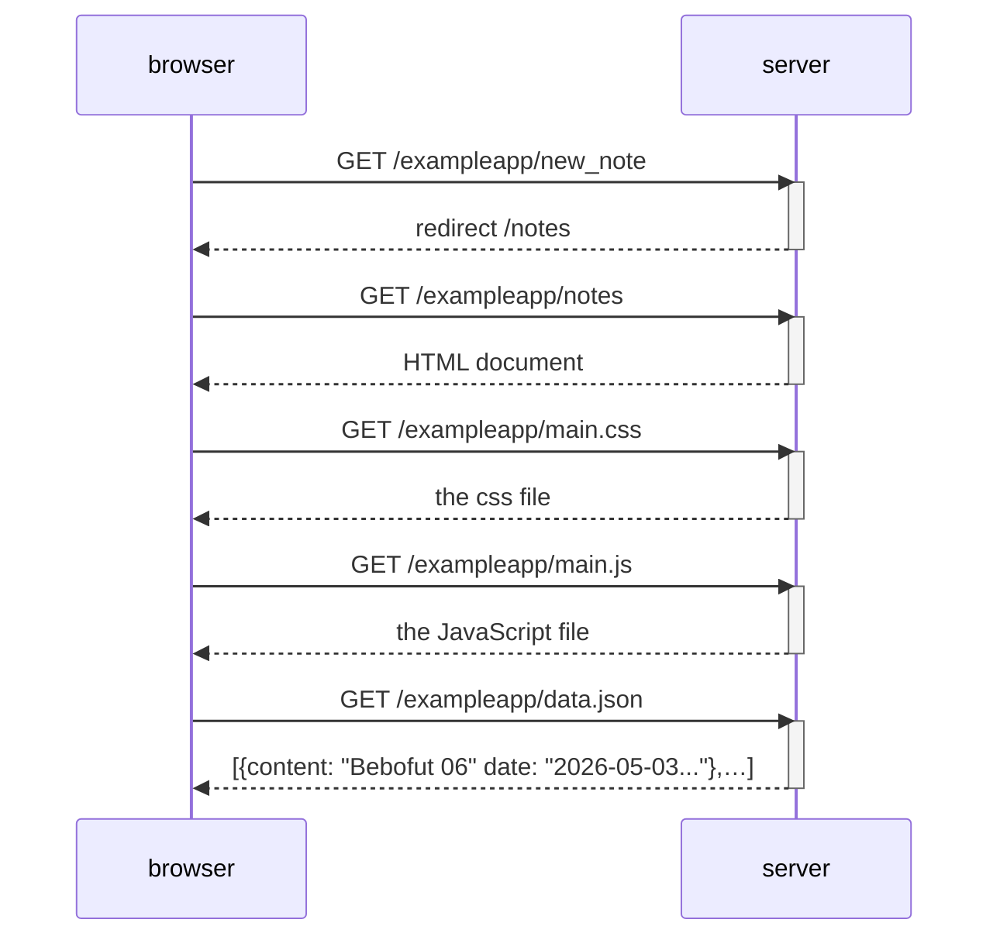

```mermaid
sequenceDiagram
    participant browser
    participant server

    browser ->> server: GET /exampleapp/new_note
    activate server
    server -->> browser: redirect /notes
    deactivate server

    browser ->> server: GET /exampleapp/notes
    activate server
    server -->> browser: HTML document
    deactivate server

    browser ->> server: GET /exampleapp/main.css
    activate server
    server -->> browser: the css file 
    deactivate server

    browser ->> server: GET /exampleapp/main.js
    activate server
    server -->> browser: the JavaScript file 
    deactivate server

    browser ->> server: GET /exampleapp/data.json
    activate server
    server -->> browser: [{content: "Bebofut 06" date: "2026-05-03..."},…]
    deactivate server
```