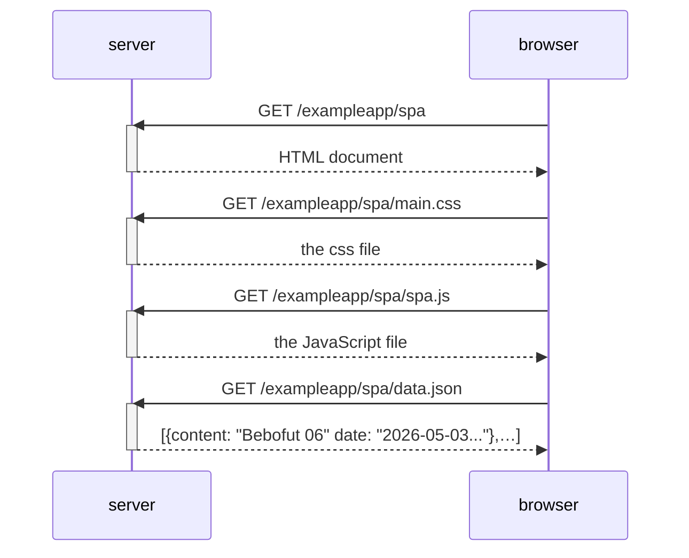

```mermaid
sequenceDiagram
    participant server
    participant browser

    browser ->> server: GET /exampleapp/spa
    activate server
    server -->> browser: HTML document
    deactivate server

    browser ->> server: GET /exampleapp/spa/main.css
    activate server
    server -->> browser: the css file
    deactivate server

    browser ->> server: GET /exampleapp/spa/spa.js
    activate server
    server -->> browser: the JavaScript file
    deactivate server

    browser ->> server: GET /exampleapp/spa/data.json
    activate server
    server -->> browser: [{content: "Bebofut 06" date: "2026-05-03..."},…]
    deactivate server
```